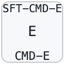
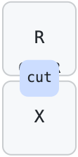
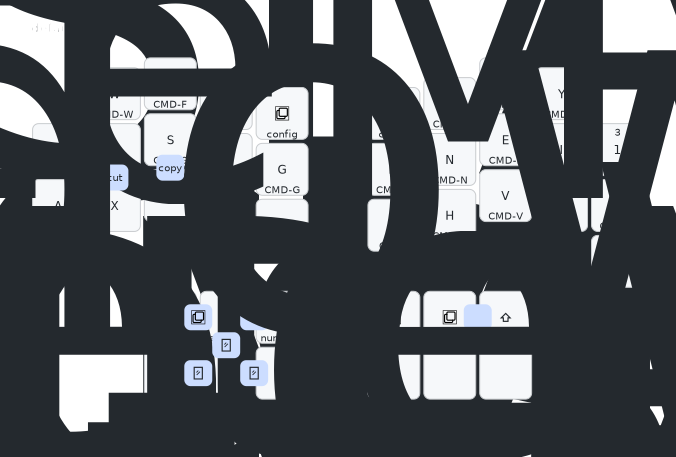

# ZMK-CONFIG generator

This is my `zmk-config` generator, it is written in TS and is located under `./yanConfig/index.ts`

## Why

Basic layers, are ok to write by hand, but tap dances are just horrible in both ZMK and QMK, my config generator of ~500 lines in JavaScript generates `.keymap`  ~5000 lines long. How am I supposed to maintain it manually?

## Features

- Mirror layer
- Create layer from another, but with modifier
- Easily define macros, tap-dance etc
- Combos are defined per layer and are human readable.
- layers defined using their names, and if I ever need to rearrange layer I would not have to kill myself

I.e. tap-dance for key like `'E,LG(E),LS(LG(E))'` means emit `E` on press, `LG(E)` on hold and `LS(LG(E))` on tap-and-hold.  
The declaration `'+L'` means emit `L` on tap and `LG(L)` on hold.
Overall it allows to keep full layer worth of keys with tap-dances on a single laptop screen

## Keymap


|||
|-------------|-------------|
| | Button like this means it fires E on tap, CMD-E on hold, and SFT-CMD-E on tap-and-hold. Allows to easily fire modifiers with one finger.|
| | This means that if I tap simultaneously `R` and `X` the `cut` command will fire.|


You can see full keymap [here](./yanConfig/keymap/layers/__combined.svg)


## Tap dance mess

Tap-dances on both ZMK and QMK are a mess. I'm not blaming developers, they did an awesome job, I just state the fact that the API is super convoluted and misleading.
Especially timings.
Consider this: You have a button with 4 functions.

- **tap** emits 1
- **hold** emits 2
- **tap-n-hold** emits 3
- **double-tap** emits 4

And you have a timeout set to 100ms to trigger from one state to another
You'd expect that:

- press and release less than 100ms will emit 1
- press and hold longer than 100ms will emit 2
- press wait less than 100ms, release, press again for longer than 100ms will emit 3
- press wait less than 100ms, release, press wait less than 100ms, release will emit 4

Your expectations are wrong.
Due to the nested nature of tap-dance and tap-n-hold functions their timeouts overlap and subtract and I encourage you to set timeouts to some ridiculous high number like 5000ms and observe for yourself actual timings with a stopwatch.

This is what I saw:

- press and release less than **200ms** will emit 1
- press and hold longer than **200ms** will emit 2
- press wait less than **200ms**, release, press again for longer than 100ms will emit 3
- press wait less than **200ms**, release, press wait less than **100ms**, release will emit 4

That makes setup counter intuitive and adjusting timings very hard.

## Do not spam HOLD key

One more wired (but sensible for developers) default is that the `hold` key is repeated and not clicked just once.
That makes tap-dance for hotkeys scary to use. Imagine I have a `tap` to `Q` and `hold` to `CMD+Q` button.
Hold it a bit too long and it will start firing `CMD+Q`s like crazy, closing all the apps.
What I actually want is to emit `CMD+Q` only once regardless of how long I keep the key pressed.
Same for opening new tabs, etc.
Essentially `hold` keys are usually never need to be repeated, but they are hard to not repeat without explicit fix.

## Example

```javascript
 var keymap = {
    default: {
      keys: [
        ['Q,LG(SLASH),LA(LG(Q))', 'W,LG(W),LG(Q)', 'F,LG(F),LA(LG(F))', 'P,LG(P),LS(LG(P))', '&mo config'],
        ['+A', '+R', '+S', '+T', 'G,LG(G),LG(LS(G))'],
        ['Z', 'X', 'C', '+D', 'B,LG(B),LG(LS(B))'],

        ['&mo windows', '&mo arrows', '&mo numbers'],
        ['&mo symbols', '&mo default_mirror', '&mo colemak_shift'],

        ['&mo config', '+L', '+U', '+Y', 'N1,N2,N3'],
        ['+M', 'N,LG(N),LG(LS(N))', 'E,LG(E),LS(LG(E))', 'I,LG(I),LG(LA(I))', '+O'],
        ['+J', '+H', '+V', '+K', '&none'],

        ['SPACE', '&mo symbols', '&mo colemak_shift'],
        ['&mo numbersf', '&mo numbers', '&globeCaps'],
      ],
      sensor: '&yan_encoder',
      combos: [
        { keys: [8, 13], binding: 'LG(V),LG(LS(V))' },
        { keys: [7, 12], binding: 'LG(C)' },
        { keys: [6, 11], binding: 'LG(X)' },
      ],
    },
    ...
```